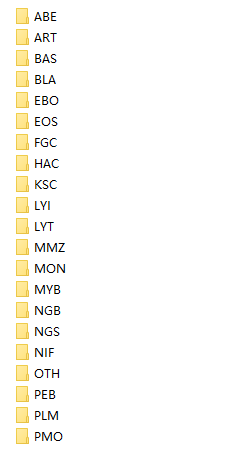
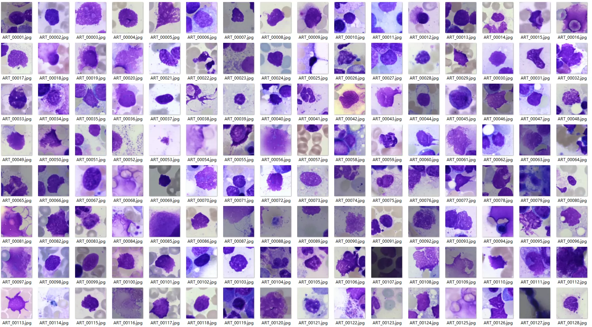
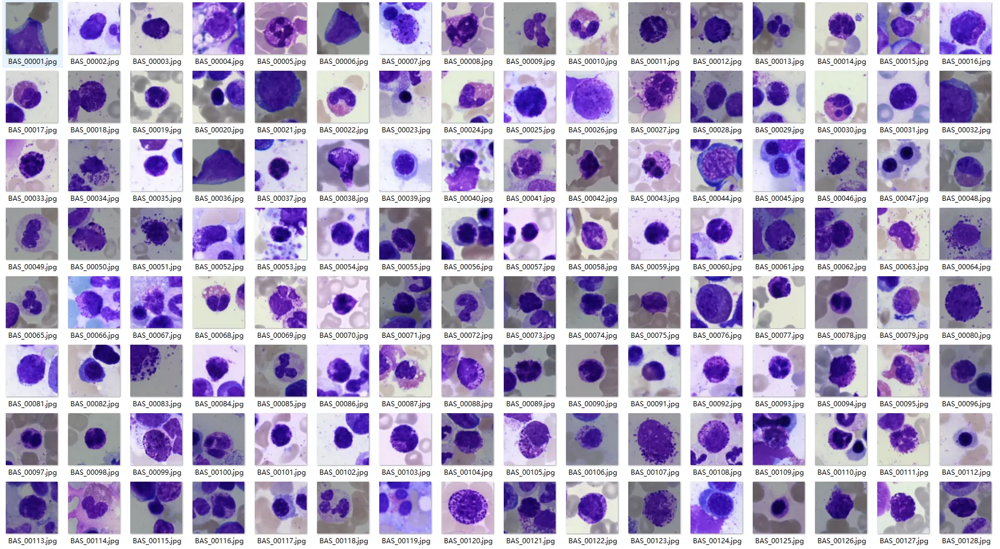
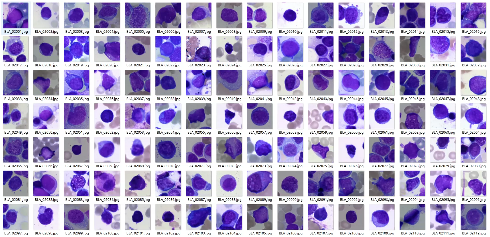
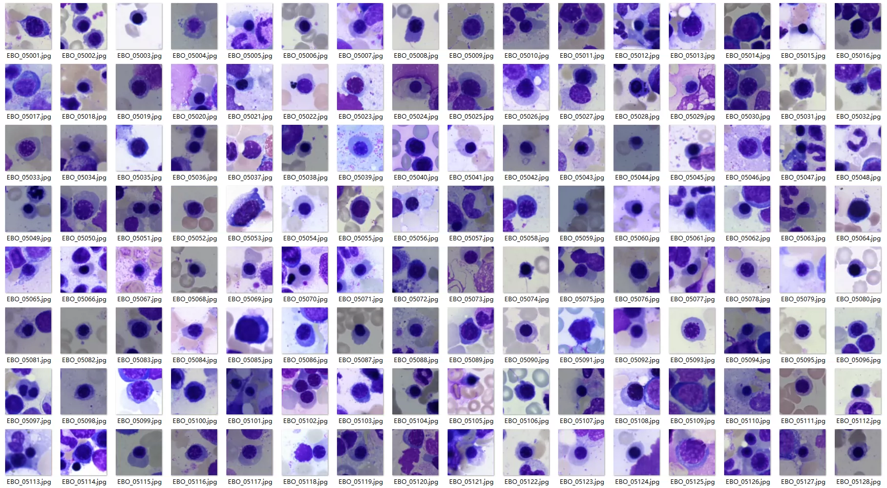
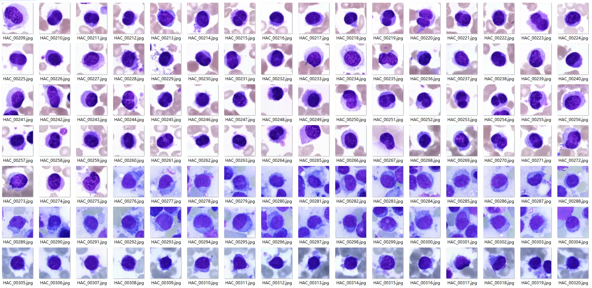
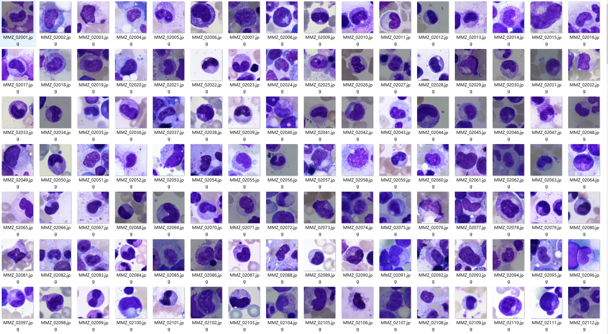

## Body

- 骨髓细胞分类数据集
- 原始淋巴细胞
- 有核红细胞
- 原始红细胞等
- 一共十七万+图片，一共21类 6.46G
- ABE：Abnormal Erythroblast，异常有核红细胞
- EBO：Erythroblast，有核红细胞（原红 / 早幼红 / 中幼红 / 晚幼红统称）
- NIF：Nucleated Immature Erythrocyte，幼稚有核红细胞
- PEB：Proerythroblast，原始红细胞
- BAS：Basophil，嗜碱性粒细胞
- EOS：Eosinophil，嗜酸性粒细胞
- NGB：Neutrophilic Band Granulocyte，中性杆状核粒细胞
- NGS：Neutrophilic Segmented Granulocyte，中性分叶核粒细胞
- PMO：Promyelocyte，早幼粒细胞
- MON：Monocyte，单核细胞
- MYB：Monoblast，原始单核细胞
- FGC：Foreign-body Giant Cell，异物巨细胞
- HAC：Histiocyte，组织细胞
- LYI：Immature Lymphocyte，幼稚淋巴细胞
- LYT：Mature Lymphocyte，成熟淋巴细胞
- ART：Artificial Lymphocyte，人工 / 异常淋巴细胞（少见，多为报告备注）
- BLA：Blast Lymphocyte，原始淋巴细胞
- PLM：Plasma Cell，浆细胞
- MMZ：Mature Plasma Cell，成熟浆细胞
- Ksc：Karyocyte，有核细胞（泛指，非特指某类）
- OTH：Other Cells，其他细胞（报告中未分类的异常 / 少见细胞）

## Images

item_1038714213442

Here is a pay link on Stripe ( https://buy.stripe.com/3cs8yP7sY87d0vu9AB ). Please contact me lonlonago@foxmail.com after funding $89, and I will send you a complete data files , thank you!

